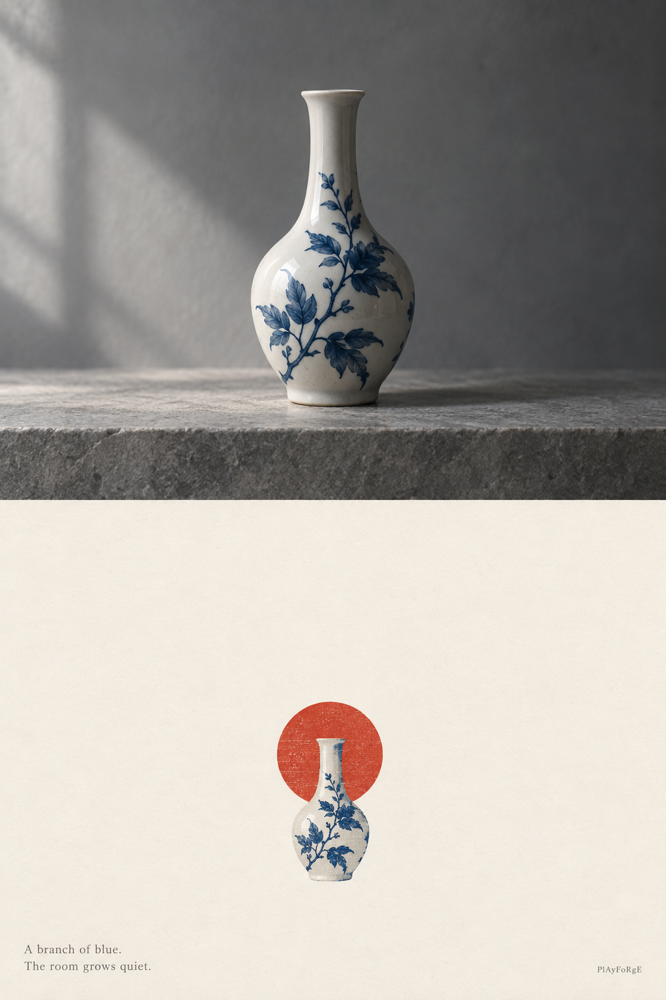

# ZINE-001 · 器物样板



## 样板身份

- 类型：**合成风格样板**，无外部参考图；上下两层均为原创生成。
- 题材：象牙白陶瓷瓶，细长瓶颈、圆腹、钴蓝枝叶纹样。
- 工具：内置 imagegen，2026-09-16。
- 展示参数：整张 2:3，上下等分；下层象牙白底、单一朱红圆形；英文两行诗、极小 PlAyFoRgE 署名。
- [实际使用的完整提示词](generation-prompt.md)。这是样板专用提示词，实际垫图任务使用 [通用母提示词](../references/master-prompt.md)。

## 检视说明

上层为灰色背景的照片感器物，下层缩小为纸本转译，留白目测超过 65%，保留细颈圆腹及蓝色枝叶的辨识结构；包含一个朱红圆形、两行文字与署名。未作像素面积测量。上下纹样存在简化，不能据此认定精确纹样保真通过。

该图展示风格方向，不是「已有原图严格保真编辑」测试，也不验证人物脸部抽象。人物、建筑、景物和环境的真实垫图样板可后续补入本目录，分别记录输入、参数、提示词和检视结果。

## 复用调用

```text
使用 $zine-library，style=ZINE-001，基于我上传的器物参考图，
accent_color=朱红，accent_shape=圆形，text_language=en，mode=prompt。
```

没有附图但只想复现这一合成样板时，可以直接使用上方的样板提示词；不要声称它来自用户提供的照片。
